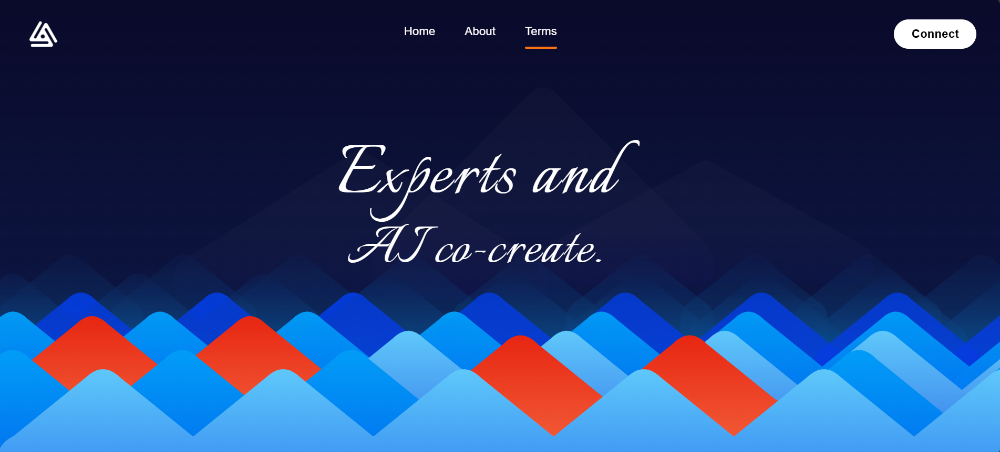

# 🏞 HillValley Landing Page

 <!-- Replace with actual screenshot -->
[](https://reactjs.org/)
[](https://www.typescriptlang.org/)
[](https://vitejs.dev/)
[](https://www.framer.com/motion/)
[](https://tailwindcss.com/)

A visually engaging **landing page** built with **React**, **TypeScript**, **Vite**, and **Framer Motion**, featuring animated hills, hero text, and sequential animations. Perfect for demonstrating interactive UI animations and responsive design.

---

## ✨ Features

- Animated **hills** using **Framer Motion**
- Sequential pop-up animations for hill targets
- Dynamic **Hero Text** overlay
- Background runner animation
- Fully **responsive** (desktop, tablet, mobile)
- Easily extensible for additional animations or sections
- Optimized for **performance** and smooth user experience

---

## 🛠 Technologies Used

- **React (v18+)** – Component-based UI  
- **TypeScript** – Strongly-typed development  
- **Vite** – Fast development server and build tool  
- **Framer Motion** – Animation and interactive transitions  
- **Tailwind CSS** – Utility-first styling  

---

## 📁 Project Structure

```bash
landing-page/
│
├─ public/                  # Static assets
├─ src/
│  ├─ assets/               # Images, logos, media
│  ├─ components/           # React components
│  │  ├─ Background.tsx
│  │  ├─ BackgroundRunner.tsx
│  │  ├─ HillShape.tsx
│  │  ├─ HillValley.tsx
│  │  ├─ HillValleyWrapper.tsx
│  │  ├─ Header.tsx
│  │  └─ HeroText.tsx
│  ├─ utils/                # Helper functions
│  │  └─ hillUtils.ts
│  ├─ App.tsx
│  └─ main.tsx              # Vite entry point
├─ package.json
├─ tsconfig.json
├─ vite.config.ts
└─ README.md
````

---

## 🚀 Getting Started

### Prerequisites

* **Node.js** v18+
* **npm** v9+ or **yarn**

### Installation

```bash
# Clone the repository
git clone https://github.com/Alan21303/HillValley-landingpage-react.git
cd HillValley-landingpage-react

# Install dependencies
npm install
# or
yarn
```

### Running Locally

```bash
# Start development server
npm run dev
# or
yarn dev
```

Open [http://localhost:5173](http://localhost:5173) in your browser to view the landing page.

---

## 📜 Available Scripts

| Command           | Description                           |
| ----------------- | ------------------------------------- |
| `npm run dev`     | Start development server              |
| `npm run build`   | Build for production (`dist/` folder) |
| `npm run preview` | Preview production build locally      |

---

## 🌟 Live Demo

 <!-- Optional: Add an animated GIF of the landing page -->

---

## 🎨 Future Enhancements

* Add **scroll-based animations** for more interaction
* Integrate **light/dark mode toggle**
* Include **custom fonts** and branding assets
* Add **multi-section landing page** support

---

## 💻 Contributing

Contributions, issues, and feature requests are welcome!

1. Fork the repository
2. Create your feature branch: `git checkout -b feature/new-animation`
3. Commit your changes: `git commit -m "Add new animation"`
4. Push to the branch: `git push origin feature/new-animation`
5. Open a Pull Request

---

